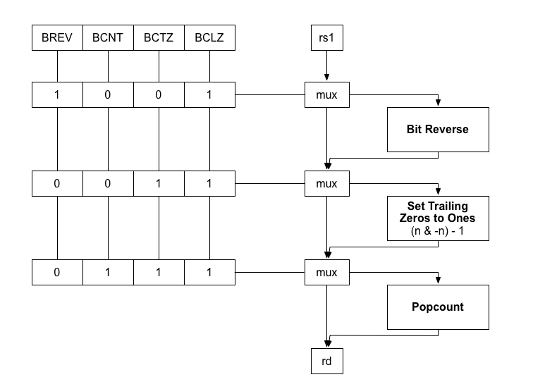

Bit Manipulation
=====================

Candidate instructions for B extension (Bit Manipulation)

Opcode                          | Long Name                                 | Description
:----------                     | :-------------                            | :---------------
<sub>RLL[W] rd,rs1,rs2</sub>    | <sub>Rotate Left Logical</sub>            | <sub>Rotate bits in rs1 left by the amount in rs2</sub>
<sub>RRL[W] rd,rs1,rs2</sub>    | <sub>Rotate Right Logical</sub>           | <sub>Rotate bits in rs1 right by the amount in rs2</sub>
<sub>RLLI[W] rd,rs1,shamt</sub> | <sub>Rotate Left Logical Immediate</sub>  | <sub>Rotate bits in rs1 left by the immediate</sub>
<sub>RRLI[W] rd,rs1,shamt</sub> | <sub>Rotate Right Logical Immediate</sub> | <sub>Rotate bits in rs1 right by the immediate</sub>
<sub>BCLZ[W] rd,rs1</sub>       | <sub>Bit Count Leading Zeros</sub>        | <sub>Count leading zero bits in rs1</sub>
<sub>BCTZ[W] rd,rs1</sub>       | <sub>Bit Count Trailing Zeros</sub>       | <sub>Count trailing zero bits in rs1</sub>
<sub>BCNT[W] rd,rs1</sub>       | <sub>Bit Count</sub>                      | <sub>Count number of bits set in rs1</sub>
<sub>BREV[W] rd,rs1</sub>       | <sub>Bit Reverse</sub>                    | <sub>Reverse bits in rs1</sub>
<sub>BSWAP[W] rd,rs1</sub>      | <sub>Byte Swap</sub>                      | <sub>Swap byte order in rs1</sub>
<sub>BEXT[W] rd,rs1,rs2</sub>   | <sub>Bit Extract</sub>                    | <sub>Gather LSB justified bits to rd from rs1 using extract mask in rs2</sub>
<sub>BDEP[W] rd,rs1,rs2</sub>   | <sub>Bit Deposit</sub>                    | <sub>Scatter LSB justified bits from rs2 to rd using deposit mask in rs2</sub>
<sub>GREVI[W] rd,rs1,imm7</sub> | <sub>Generalized Bit Reversal</sub>       | <sub>Apply generalized bit reversal transorm using k=imm7 to value in rs1</sub>

## Rotate

Rotate instructions can be implemented very easily with the addition
of carry-out carry-in logic to an existing shifter. Rotates are very
simple instructions but they are frequently used in cryptographic
ciphers so the small saving in cycles (3:1) is likely worth the
additional area for processors that implement the B extension.

## Byte swap

Byte swapping instructions are essential for networking code
and cryptographic ciphers which typically use big endian formats.
A 32-bit byte swap takes 14 instructions and a 64-bit byte swap
takes 30 instructions.

```
bswap_32:
  slliw a3,a0,24
  srliw a5,a0,24
  slliw a4,a0,8
  or a5,a5,a3
  li a3,16711680
  and a4,a4,a3
  or a5,a5,a4
  li a4,65536
  addi a4,a4,-256
  srliw a0,a0,8
  and a0,a0,a4
  or a0,a5,a0
  sext.w a0,a0
  ret

bswap_64:
  slli a2,a0,56
  srli a5,a0,56
  or a5,a5,a2
  li a2,65536
  srli a3,a0,40
  addi a2,a2,-256
  and a3,a3,a2
  li a4,255
  srli a2,a0,24
  or a5,a5,a3
  li a3,16711680
  and a2,a2,a3
  slli a1,a4,24
  srli a3,a0,8
  and a3,a3,a1
  or a5,a5,a2
  slli a1,a4,32
  slli a2,a0,8
  and a2,a2,a1
  or a5,a5,a3
  slli a1,a4,40
  slli a3,a0,24
  or a5,a5,a2
  and a3,a3,a1
  slli a4,a4,48
  slli a0,a0,40
  or a5,a5,a3
  and a0,a0,a4
  or a0,a5,a0
  ret
```

## Count leading and trailing zeros

Count leading and trailing zeros can be constructed using popcount (`BCNT`)
and bit reverse (`BREV`) instructions or functional units. Given the length
of the instruction sequences and the possibility to multiplex via shared bit
reverse and popcount functional units, the count leading and trailing zeros
instructions are included.

One area saving implementation approach involves multiplexing functional units in
a pipeline containing bit reverse, neg+and+sub (leading/traling) and popcount.
The critical path the length for these bit manipulation instructions would be the
fanout of the bit reverse circuit, the neg+and+sub (set trailing zeros to ones)
circuit for (`BCLZ`) and (`BCTZ`) and the popcount circuit. The popcount instruction
(`BCNT`) would have an input bypass and bit reverse instruction (`BREV`) would have
an output bypass.



_**Figure 1: Area efficient implementation approach for count leading and trailing zeros**_

Count leading and trailing zeros could be constructed in terms of bit reverse
and popcount instructions however the area saving is a few muxes and the set
trailing zeros to ones circuit `(x & -x) - 1)`. The major area contributors with
either approach are the bit reverse and popcount functional units.

The following shows C and assembler for count leading and trailing zeros
constructed in terms of (`BREV`) bit reverse and (`BCNT`) popcount.

### C
```
#include <stdint.h>

uint32_t bctz_w(uint32_t x) { return __builtin_popcount((x & -x) - 1); }
uint64_t bctz_d(uint64_t x) { return __builtin_popcountll((x & -x) - 1); }
uint32_t bclz_w(uint32_t x) { uint32_t y = __builtin_bitreverse32(x); return __builtin_popcount((y & -y) - 1); }
uint64_t bclz_d(uint64_t x) { uint64_t y = __builtin_bitreverse64(x); return __builtin_popcountll((y & -y) - 1); }
```

### Asssembler
```
# count trailing zeros
.macro BCTZ.X  rd, rs
	neg     \rd, \rs
	and     \rd, \rd, \rs
	addi    \rd, \rd, -1
	bcnt    \rd, \rd
.endm
```

```
# count leading zeros
.macro BCLZ.X  rd, rs
	brev    t0,  \rs
	neg     \rd, t0
	and     \rd, \rd, t0
	addi    \rd, \rd, -1
	bcnt    \rd, \rd
.endm
```

## Bit Extract

Gather LSB justified bits to rd from rs1 using extract mask in rs2.
Bits are extracted from the source register using bit positions
enabled in the mask register and are placed in the result as
popcount(mask) LSB contiguous bits.

Register | Value
:--      | :--
source   | 0b11110100
mask     | 0b01100011
result   | 0b00001100

## Bit Deposit

Scatter LSB justified bits from rs2 to rd using deposit mask in rs2.
Bits are deposited from the source register using popcount(mask)
LSB contiguous bits and are placed in the result at the bit positions
enabled in the mask register.

Register | Value
:--      | :--
source   | 0b11110100
mask     | 0b01100011
result   | 0b00100000

## Generalized Bit Reversal

The GREV instruction performs the following operation:

```
uint32_t grev32(uint32_t x, int k)
{
    if (k &  1) x = ((x & 0x55555555) <<  1) | ((x & 0xAAAAAAAA) >>  1);
    if (k &  2) x = ((x & 0x33333333) <<  2) | ((x & 0xCCCCCCCC) >>  2);
    if (k &  4) x = ((x & 0x0F0F0F0F) <<  4) | ((x & 0xF0F0F0F0) >>  4);
    if (k &  8) x = ((x & 0x00FF00FF) <<  8) | ((x & 0xFF00FF00) >>  8);
    if (k & 16) x = ((x & 0x0000FFFF) << 16) | ((x & 0xFFFF0000) >> 16);
    return x;
}
```

- Byte swap (`BSWAP`) can be formulated as a pseudo instruction in terms
  of GREVI where k=24.

- Bit Reverse (`BREV`) can be formulated as a pseudo instruction in terms
  of GREVI where k=31.
